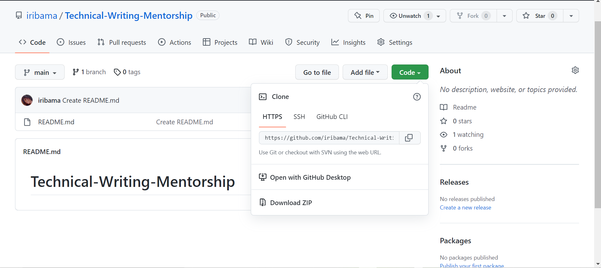

# Introduction to GitHub  
## Overview 

Software developers have the need to preserve various stages of their software source code, maintain and share them with a like-minded community. Tracking the source code and managing it, like making changes is known as **version control**. It translates to controlling different versions of your work. Version control can be carried out using **Git** and **GitHub**. 

## What is GitHub? 

**GitHub** is an open-source platform that is used by developers to store, work on and share their projects. They can also collaborate with other developers. As a code hosting platform, GitHub is an essential resource for developers. It can also be used for no-code purposes, such as storing documentation and design slides. It was founded in 2007. 

It serves as a resume of sorts, as a developer’s profile on the website shows the projects they have built and their collaborations. More recently, it is being requested by recruiters during job applications. 

## Why GitHub? 

Other applications have version control features, like tracking changes and keeping storage of various stages of work, Google Workspace tools, and Microsoft Office being typical examples. Useful as they might be, they cannot be used to work on software projects. This shows the relevance of an advanced version control system, GitHub. 

It is a free, cloud hosting platform. A developer’s project can be accessed by others if it is stored in a public repository. Repositories can also be made private, to be accessed by the owner and invited collaborators.  

The original project is not affected by collaborations. To add a new repository to an existing project, the intending collaborator clones – copies the project to their local server, adds their contribution and shared the newly added changes to the main project by pushing it. 

## Git vs. GitHub 

**Git** is open-source software that is used for version control. It is free and is used to build and contribute to projects that are hosted on GitHub. It can be accessed by developers on the **CLI** (command line interface). To use this, Git and GitBash are to be installed on the machine.  

An important step for the developer to take is to set up the terminal using their username and email address. This can be done using these commands. 

`git config –global user.name “username”` 

`git config – global user.email “email address”`  

These commands link the command line terminal to GitHub, enabling successful contributions.

## How to Clone 

To contribute to a project, the repository must be cloned from the project's main page. Cloning is getting a copy of a project that is to be worked on. To clone on GitHub Desktop, there is a provision to clone.  

On the terminal, the URL cloned from the repository's main page is pasted after writing the `git command` on the terminal, like this.  
  
  
   
 
  

This automatically replicates the project to a local repository, and changes can be made here without affecting the original. 

## How to Create a Pull Request 

Pull requests are created by forking a repository, creating a branch, which is the cloned version of the project and making the contributions there. Pull requests can only be done with different branches. It cannot be done without access to the main branch. If the project belongs to a company or organization, access must be granted to ensure the success of a pull request. 

The process is implemented for ready projects by clicking the **Create Pull Request button**. If the project is still in the works, a draft pull request can be created if the project is not ready to be uploaded for review. The **Create Draft Pull Request** is used for this. 

After a pull request is created, it is then reviewed by the organizers of the project. After the review, it is merged into the repository of the main project. 

## How to Create a Commit 

Commits are used to store various stages of a project on the terminal, and stored in the local repository. This enables the developer to store different project versions without making changes to the default branch.  

`git commit` is the command used to initialize this and is often used with the `git add` command. Git add is used to add a new piece of information to the project being manipulated, while git commit secures these changes and stores them.  

`git commit –m “commit message”` 

To confirm the success of the git commit command, run `git status` in the terminal. It shows the state of the commit. 

## GitHub Desktop vs. GitHub CLI 

**GitHub Desktop** can be described as an application that allows developers to work with open-source software with a graphic user interface (GUI), while **GitHub CLI** is an open-source tool provided by CLIs (command line interfaces), to provide access to GitHub on the terminal. Pull requests, issues and other GitHub actions can also be carried out. 

GitHub CLI is not an alternative to Git because it does not have commands that are used to make commits. Git commit is an essential command that cannot be done away with.  

GitHub CLI requires Git to be installed on a machine before it is optimized properly. On GitHub Desktop, the command line is not required as interactions can be carried out using a GUI. 

## Conclusion 

Git and GitHub have proven to be exceptional tools for developers to build, maintain and collaborate on projects using open-source software. When handled effectively, it yields efficient results.  
 To push a project to the local branch on GitHub after making changes, git push is used. After this, the pull request can be created and reviews can be requested for.  
 it is important to use the same email address on Git and GitHub to prevent complexities.